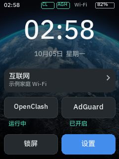
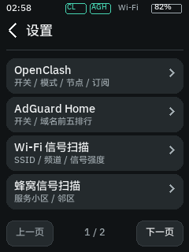
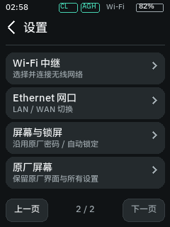
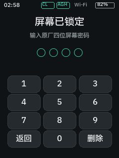
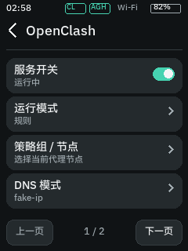
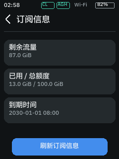
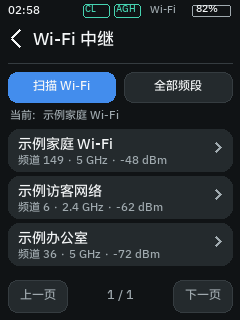
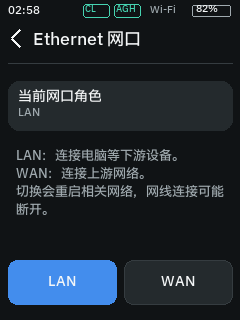
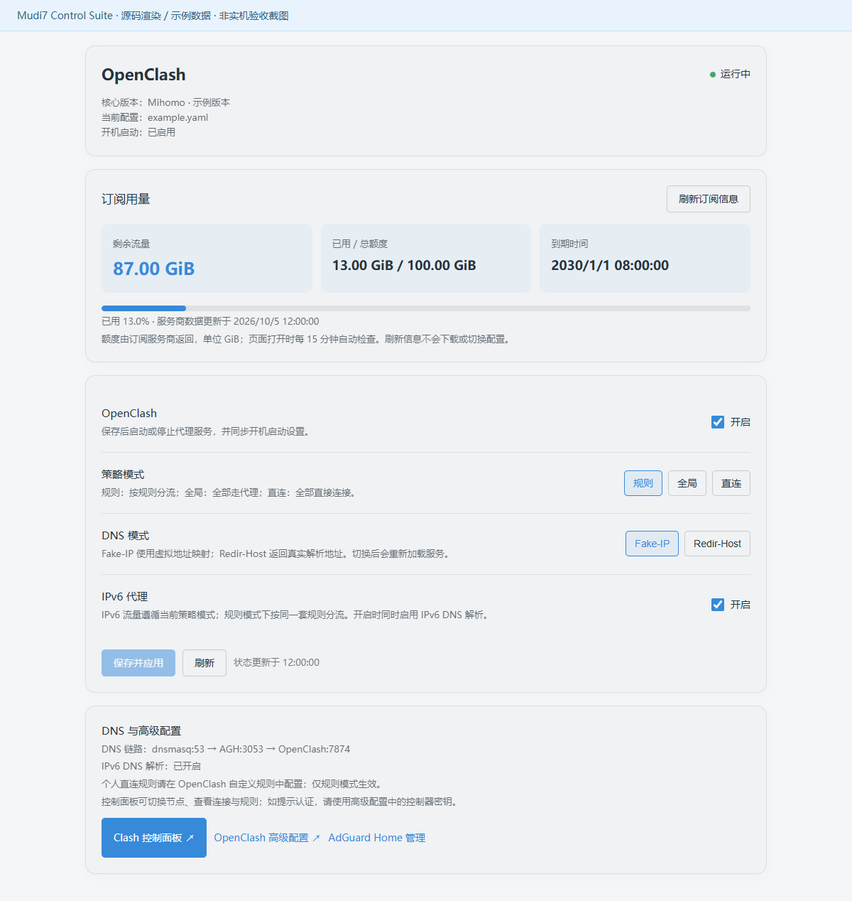

# Mudi7 Control Suite

面向 **GL.iNet Mudi 7 / GL-E5800** 的实验性中文控制套件：定制触摸屏、原厂管理网页扩展、OpenClash / AdGuard Home 联动，以及 Wi-Fi / 蜂窝信号查询。

> **当前状态：实验版本，仍需修复与 UI 重做。** 实体设备使用者已反馈“多个功能不正常、界面不够美观”。本仓库先保存现有实现和可复现资料，不将离线测试通过等同于所有实机功能可用。不要在唯一的上网/管理设备上盲目运行安装脚本。

发布快照日期：2026-10-05（北京时间）。这是源码整理版，不是原厂固件、刷机包、OpenClash 安装包或完整的一键安装器。

## 导航

- [功能与验证边界](#功能与验证边界)
- [截图预览](#截图预览) · [全部界面截图](docs/SCREENSHOTS.md)
- [环境与依赖](#环境与依赖)
- [部署和恢复](#部署和恢复)
- [开发与测试](#开发与测试)
- [已知限制](#已知限制)
- [安全与脱敏](docs/SECURITY.md)
- [文件部署对应表](docs/DEPLOYMENT.md)

## 功能与验证边界

| 模块 | 当前实现 | 验证边界 |
| --- | --- | --- |
| 定制屏幕 | 中文首页、状态栏、两页设置、触摸/分页、原厂风格背景与卡片 | 240×320 渲染、锁屏实际画面和服务切换已检查；实体触摸体验仍待逐项验收 |
| OpenClash | 开关，规则/全局/直连，Fake-IP/Redir-Host，IPv6，策略组与节点选择 | 状态读取和离线参数测试通过；屏幕上的所有修改流程不能视为已完成实机验收 |
| 订阅信息 | 已用/总额/剩余 GiB，到期时间，刷新及失败提示 | 依赖服务商返回 `Subscription-Userinfo`；无元数据时不能计算/猜测 |
| AdGuard Home | 开关、DNS 总量、请求/拦截域名前五 | 统计读取与前五裁剪已测试；不改变独立 AGH 仪表盘完整排行 |
| Wi-Fi 扫描 | SSID、频道、频段、频率、RSSI、安全能力、BSSID；筛选和分页 | 使用原厂 repeater 扫描；不是频谱分析仪，不保证每个频段均有结果 |
| 蜂窝查询 | LTE/NR-SA/NR-NSA 服务小区及可解析的 LTE 邻区 | 只读 QENG/COPS 当前信息；不是全运营商/全频段搜网或基站定位工具 |
| Wi-Fi 中继 | 选择扫描网络、已保存网络复用、掩码密码输入、连接确认 | 实际连接替换未在发布验收中执行，可能中断网络，需实体测试 |
| Ethernet | LAN/WAN 切换确认、保存/恢复 LAN VLAN 参数 | 参数构造有测试；实际切换未在发布验收中执行，需备用管理通道 |
| 原厂锁屏 | 复用原厂四位密码，自动锁定，常亮/背光策略，错误冷却 | 原密码校验、锁屏逻辑已检查；不会创建第二套用户密码 |
| 回退 | 保留原厂 gl_screen，按钮/SSH 切回，连续崩溃恢复原厂 | 原开发设备上切回和三次异常退出恢复已测试；不是所有异常的兜底保证 |
| 原厂网页 | `#/openclash`、`#/radio-scan` 扩展，AGH 前五统计接入 | 依赖厂商 OUI/UBUS/NGINX 实现和当前固件，升级可能不兼容 |

### 不是原厂菜单插件

屏幕部分是**独立绘制的替代 UI**。启用时暂停原厂 `gl_screen`，返回时重新启动原厂；没有给闭源原厂二级菜单注入新组件，也没有替换 `/usr/bin/gl_screen`。网页部分则接入现有原厂登录/菜单框架。

沿用社区 [gl-e5800-dashboard](https://github.com/robavionix/gl-e5800-dashboard) 的底层 framebuffer、触摸、电池和电源键代码；没有启用其天气、汇率、游戏、测速、SMS 等整套业务页面。

## 截图预览

**所有公开截图均为示例数据渲染，不是实机功能验收证据。** 不含真实 SSID/BSSID、节点名称、浏览域名排行、订阅账户额度或密码。下面使用现有代码呈现当前 UI，不表示已完成新一轮美化。

| 首页 | 设置第一页 | 设置第二页 | 锁屏 |
| --- | --- | --- | --- |
|  |  |  |  |

| OpenClash | 订阅信息 | 中继选择 | 网口切换 |
| --- | --- | --- | --- |
|  |  |  |  |

网页 OpenClash 扩展（真实组件函数渲染，示例状态，独立文档背景）：



更多页面、两类扫描、键盘、确认弹窗和 AGH 示意见 [完整截图图库](docs/SCREENSHOTS.md)。

## 工作方式

屏幕读取 `/dev/input/event0`，向 `/dev/fb0` 写入 RGB565 画面；独立电源键监听读取 `/dev/input/event1`。屏幕不额外启动 HTTP 服务。

操作通过固定允许清单调用本机厂商 JSON-RPC，或调用本机 Mihomo/AGH API。网页继续使用原厂管理员会话。屏幕和网页共享控制、DNS 协同及扫描后台，避免各自建立另一套网络配置。

当前整合 DNS 链路为：`客户端 → dnsmasq:53 → AGH:3053 → OpenClash:7874`。这需要完整后端与现有 OpenClash/AGH 配置配合，**仅复制屏幕文件不会自动建立 DNS 链路**。明确关闭 OpenClash 时才恢复独立外部 DNS；核心启动失败期间不悄悄使用外部 fallback。

## 环境与依赖

原开发设备：GL-E5800，原厂固件 4.10.0 / OpenWrt 23.05.4，aarch64，240×320 屏幕，Quectel RG650V-EU。这里只记录开发环境，不承诺其他型号、固件、调制解调器兼容。

设备侧依赖：

- 原厂 `gl_screen` 程序、屏幕字体和壁纸、repeater / port_info / screen / modem 的 RPC/UBUS 接口。
- Python 3、NumPy、Pillow；原厂 framebuffer/backlight/input 设备可用。
- Lua 5.1 + cjson + nixio/uci/ubus，Ruby + YAML，curl，nftables，procd。
- 已配置的 [OpenClash](https://github.com/vernesong/OpenClash) + Mihomo，及 [AdGuard Home](https://github.com/AdguardTeam/AdGuardHome)。这些程序/核心和节点配置**不打包在本仓库**。
- 原厂 NGINX Lua/OUI 页面框架；不是通用 LuCI 插件。

字体/背景从已安装固件加载：

```text
/etc/gl_screen/language/ttf/default_cn_medium.ttf
/etc/gl_screen/image/wallpaper.png
```

不分发原厂字体、原厂二进制或壁纸素材文件。文档画面中的原厂背景仅用于展示现有设备上的 UI，相关素材权利属于其权利人。

## 部署和恢复

### 先读这些提醒

1. **先备份，再部署。** 保留可用的 Wi-Fi/SSH 管理通道，不能只靠准备切换角色的网口。
2. README 和 [部署对应表](docs/DEPLOYMENT.md) 是源码快照说明，不是全自动安装向导。先安装/配置好 OpenClash、AGH 和后台集成，再安装屏幕。
3. `deploy-screen.py` 是首次安装辅助：目标路径已存在时拒绝继续，**不是现有设备升级器**。你已经安装本项目时，不要重复执行。
4. `deploy-radio.py` 会替换对应扫描扩展文件；不主动扫描或连接网络。
5. 不覆盖既有 OpenClash 自定义规则/防火墙钩子、AGH 配置、原厂 NGINX 或整个 `/etc`。需合并并验证差异。

### 本地准备

```bash
git clone https://github.com/NUaris/mudi7-control-suite.git
cd mudi7-control-suite
python -m venv .venv
# 按系统方式激活 .venv
python -m pip install -r requirements-dev.txt
```

SSH 连接助手从环境变量读取信息；默认主机 `192.168.11.1`、用户 `root`，不内置密码。Linux/macOS 示例，密码用隐式输入而非写入脚本：

```bash
export ROUTER_TASK_HOST=192.168.11.1
export ROUTER_TASK_USERNAME=root
read -rs -p 'SSH password: ' ROUTER_TASK_PASSWORD; echo
export ROUTER_TASK_PASSWORD
```

先自行核对 SSH 主机密钥并建立 `~/.ssh/known_hosts`。助手拒绝未知主机，不会自动接受新密钥。Windows 可选 `ROUTER_TASK_INTERFACE_INDEX` 指定单个 SSH socket 的出口，不会修改系统路由/TUN；不要照搬别人的接口编号。

### 屏幕安装流程概要

**前提：** 固件兼容、原厂四位密码已启用且不处于锁定冷却；屏幕依赖与网页后端已经配置好。设备侧包名通常为 `python3`、`python3-numpy`、`python3-pillow`，应以本机软件源为准。不要使用 `--force-overwrite` 覆盖原厂屏幕库文件。

本地运行首次安装助手：

```bash
python deploy-screen.py
```

它上传源码、语法/离线测试和真实数据只读检查；只追加 `sysupgrade.paths` 中的保留项，不替换整份 sysupgrade 配置。**上传结束不自动启用新屏幕。** 设备检查失败时请先排错，不要跳过检查。

核验后在设备 SSH 内手动执行：

```sh
python3 /root/dashboard/prepare-live.py
/etc/init.d/homebutton enable
/etc/init.d/homebutton start
/root/dashboard/toggle.sh on
/root/dashboard/screen_sleep.sh on
/root/dashboard/toggle.sh status
```

离开本地部署终端后清除密码环境变量：`unset ROUTER_TASK_PASSWORD`（PowerShell 使用 `Remove-Item Env:ROUTER_TASK_PASSWORD`）。

### 屏幕使用

- 复用原厂四位屏幕密码；启动/唤醒重新锁定，错误输入有冷却并尊重原厂锁定状态。
- 首页进入设置；第二页包含 Wi-Fi 中继、Ethernet、屏幕设置和原厂界面入口。
- 电源键短按：定制 UI 的背光睡眠/唤醒。约 1–2 秒按住：请求切换 UI；定制界面解锁时会确认。更长按住仍保留设备关机路径。
- 原厂密码、亮度、锁屏时间应**先切回原厂**，再在原厂网页显示管理修改。
- 中继连接、网口切换等网络操作必须确认，可能造成短暂断连。不要在没有备用通道时操作。

### 恢复原厂屏幕

```sh
/root/dashboard/toggle.sh off
```

这恢复原厂屏幕与其启动设置，不卸载网页扩展或代理/AGH。需要重新启用时使用 `toggle.sh on`。

定制主程序五分钟内连续异常退出三次会自动禁用定制启动并恢复原厂。触摸、样式或逻辑出错不一定触发崩溃，不能依赖自动回退处理所有问题。

完整移除及后台恢复必须逐项参考 [部署对应表](docs/DEPLOYMENT.md)，不要直接删除整个 `/root`、`/etc` 或恢复整份旧配置覆盖后续改动。

## 开发与测试

```text
screen-custom/   中文 UI、固定 API 后端、锁屏、中继桥接与生命周期管理
screen-upstream/ 固定版本上游驱动/电源监听及许可证
*.lua/*.sh/*.rb  网页后端、DNS 协同、扫描解析及配置辅助
*.common.js     原厂框架加载的自定义网页组件
tools/          示例截图生成和离线测试工具
docs/           截图图库、部署对应、安全和发布核验说明
```

Python 界面预览需提供本地中文字体（不提交字体文件）。以下命令不访问路由器，也不启动 framebuffer 写入：

```bash
python tools/test-screen.py --font /path/to/local-cjk-font.ttf
python tools/render-screen.py --font /path/to/local-cjk-font.ttf
# 可加 --wallpaper /path/to/local-wallpaper.png；不把素材复制进仓库
python radio-parser-test.py
python adguard-rankings-test.py
node openclash-view-test.cjs
node radio-view-test.cjs
ruby personal-rules-test.rb
```

网页截图工具需安装开发依赖及 Chrome；也可用环境变量 `DOCS_BROWSER_PATH` 指定 Chromium/Edge 可执行文件：

```bash
npm install
node tools/render-web.cjs
```

示例截图使用真实自定义页面渲染函数，但不加载原厂闭源网页外壳。AGH 图是统计接口的文档示意，不是重新实现或截取原厂 AGH 页面。所有网络请求在网页截图工具中被阻止。

`screen-custom/test-fallback.py` 是**侵入式实机故障注入**，会杀死定制进程三次；不是普通测试，也不应加入自动 CI。`verify-device.py` 只读状态，但生成的真实数据预览含私人信息，不能上传到公开仓库。

## 已知限制

- 当前 UI 和多个操作仍需重做/排错，**不得以示例截图宣称所有功能可用**。具体问题应记录设备固件、页面、操作、期望与实际结果；日志必须脱敏。
- 原厂四位 PIN 不是强认证，不能代替路由器管理员密码和网络访问控制。root SSH 可以读取配置。
- 手机/电脑自行启用 DoH/加密 DNS 可能绕过 AGH；本项目没有全网拦截 DoH。
- IPv6 代理测试通过不代表运营商已提供原生公网 IPv6；ULA 和公网连接需要分别排查。
- 服务商未提供额度/到期字段时无法显示真实信息；短期缓存不是实时流量计。
- Wi-Fi 键盘主要支持 ASCII；复杂字符、企业 802.1X、网页认证等应使用原厂网页。SSID 可显示中文。
- 蜂窝邻区并非全部基站，不返回定位/完整 Cell ID/TAC，不做锁塔、锁频、切 SIM、换运营商。
- 策略组成员来自核心；有多层自动选择、长名字或特殊节点结构时仍需实机回归。
- 全局模式忽略普通分流规则；自己的直连域名规则仅在规则模式生效。
- 升级保留文件不保证厂商接口兼容；固件升级后重新核验屏幕/RPC/NGINX/防火墙。
- 后台协同涉及实际 DNS/防火墙，错误配置可能造成 DNS 不可用或断网；不适合直接套用到其他设备。

## 发布脱敏与后续计划

发布前移除真实账号名固定值、个人域名、设备 ULA 前缀、私人配置与历史截图；直连规则工具使用保留域名 `example.com`，**必须改成自己的域名后才能用于部署**。实际设备配置没有被本次源码整理修改。

未上传：SSH/AGH 密码，屏幕 PIN，控制器密钥，订阅链接或配置，Wi-Fi 密钥，AGH 授权文件，访问历史，原始配置/备份，原厂素材文件。详细策略见 [安全说明](docs/SECURITY.md)。

优先后续工作：按页面收集实体操作故障 → 修复真实状态/反馈与触摸 → 重做统一原厂风格 UI → 增加设备集成回归与安全安装/升级器。该列表是计划，不表示已经实现。

## 来源与许可证

屏幕底层来源：[robavionix/gl-e5800-dashboard](https://github.com/robavionix/gl-e5800-dashboard)，固定提交 `e01ee320eb42db46b75468fc854a21a740bac75e`。保留原 MIT 许可证及署名，见 [LICENSE](LICENSE)、[UPSTREAM.json](screen-custom/UPSTREAM.json) 和 [第三方说明](docs/THIRD_PARTY.md)。

本项目与 GL.iNet、OpenClash、Mihomo、AdGuard Home 无官方关联；品牌、原厂字体/图像/二进制及独立依赖不属于本项目的许可证授权范围。
