# 全部界面截图

本图库展示 **2026-10-05 的实验 UI 快照**。30 张单页/弹窗、1 张总览、4 张网页/统计示意，共 35 张 PNG。全部是合成示例数据，不接触真实订阅、Wi-Fi、节点或浏览历史；并非实机功能验收。

屏幕图由现有 `mudi_ui.py` 渲染，尺寸 240×320。壁纸/字体沿用本地已安装固件，仅画面展示，不分发原始素材。以下按页面用途分组。

## 首页、设置与锁屏

| 首页 | 设置 1/2 | 设置 2/2 | 密码锁屏 |
| --- | --- | --- | --- |
|  |  |  |  |

| 屏幕设置 | 切回原厂确认 |
| --- | --- |
| 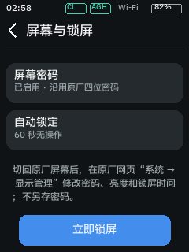 | 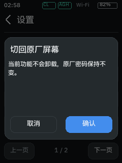 |

## OpenClash

| 服务与快捷项 | 策略模式 | DNS 模式 | 订阅额度/到期 |
| --- | --- | --- | --- |
|  | 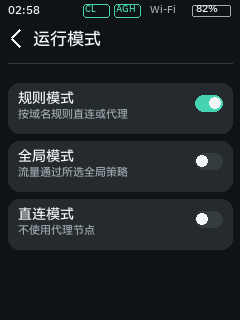 | 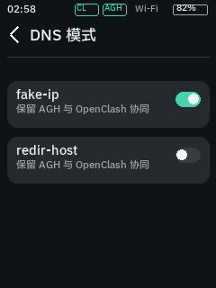 |  |

| OpenClash 第二页 / IPv6 | 策略组 | 节点成员 | 节点切换确认 |
| --- | --- | --- | --- |
| 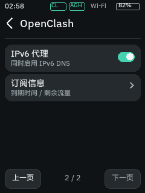 | 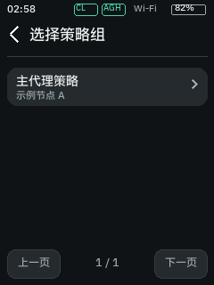 | 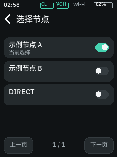 | 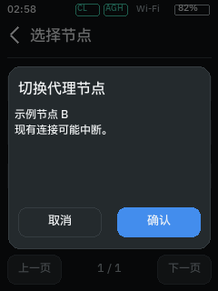 |

## AdGuard Home

| 服务/总量 | 拦截域名前五 | 请求域名前五 |
| --- | --- | --- |
| 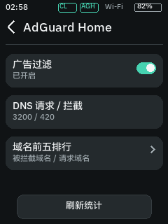 | 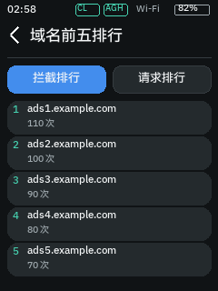 | 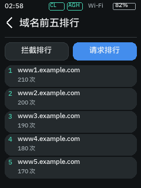 |

## Wi-Fi 扫描与中继

| Wi-Fi 扫描 | 网络详情 | 中继网络选择 | 读取保存设置 |
| --- | --- | --- | --- |
| 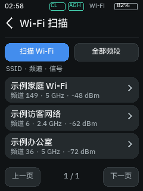 | 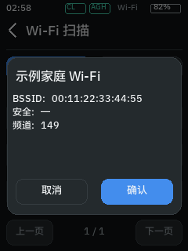 |  | 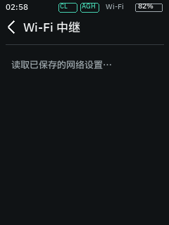 |

| 字母键盘 | 符号键盘 | 更多字符 | 连接确认 |
| --- | --- | --- | --- |
| 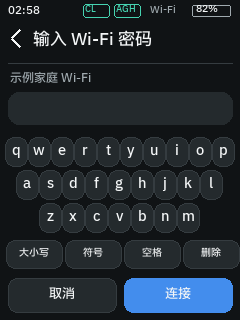 | 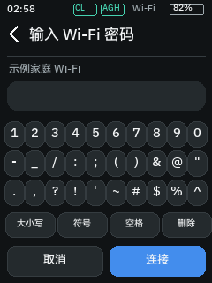 | 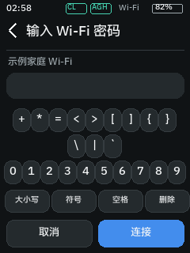 | 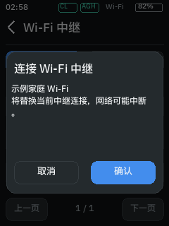 |

大写键盘：


## 蜂窝与 Ethernet

| 服务小区 | 邻区 | LAN/WAN 选择 | 切换确认 |
| --- | --- | --- | --- |
| 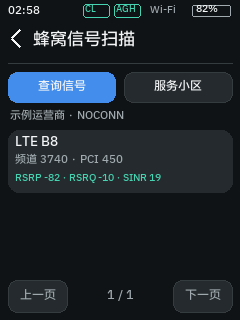 | 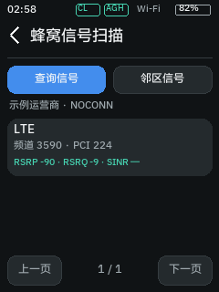 |  | 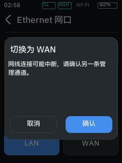 |

## 网页扩展

OpenClash 和无线页面由仓库内的真实 Vue `render` 函数输出，使用示例状态及独立文档背景；未包含原厂闭源网页外壳。

### OpenClash


### Wi-Fi 扫描

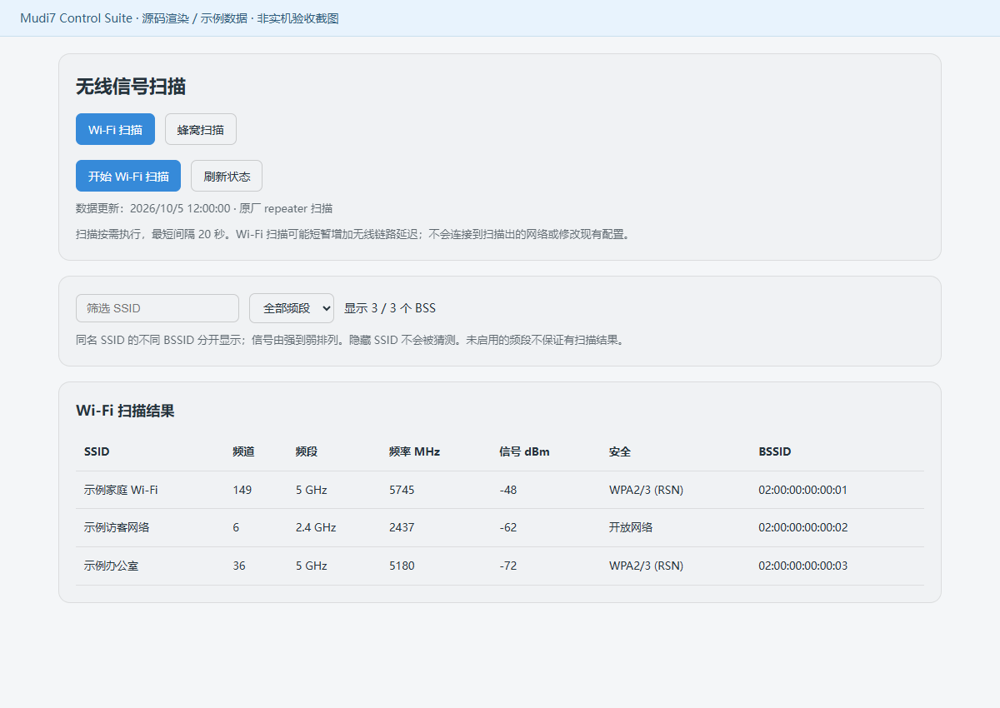

### 蜂窝查询

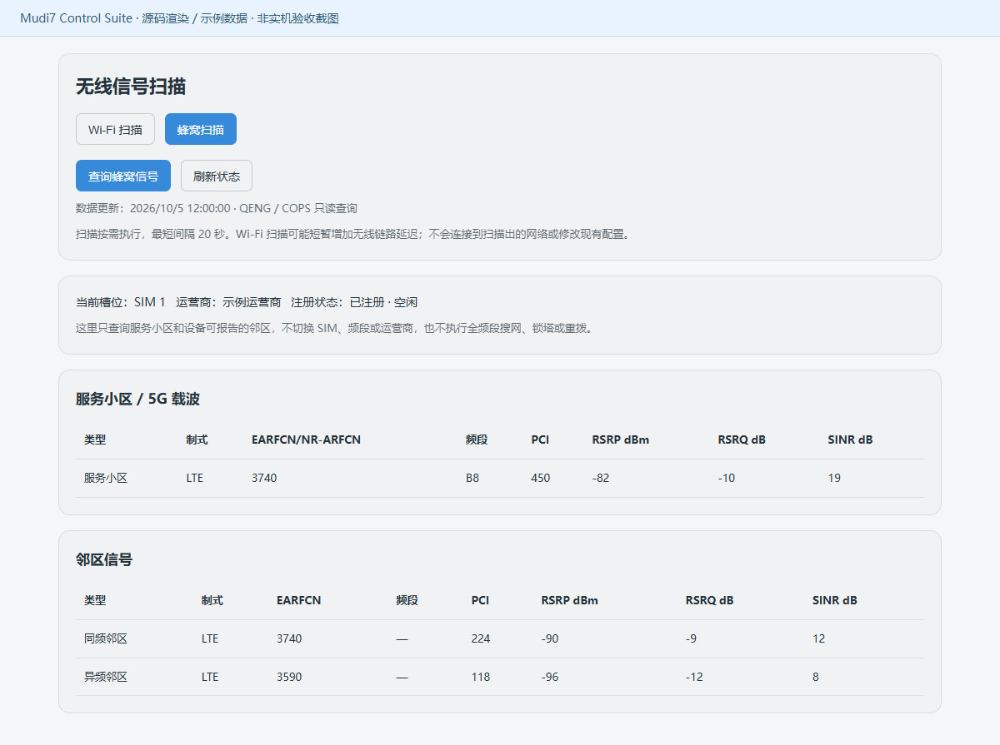

### AGH 前五统计接口示意

这是文档工具绘制的接口输出示意，**不是原厂 AGH 网页截图**。实际原厂页面的排版取决于固件；这里只说明前五数据的形态。

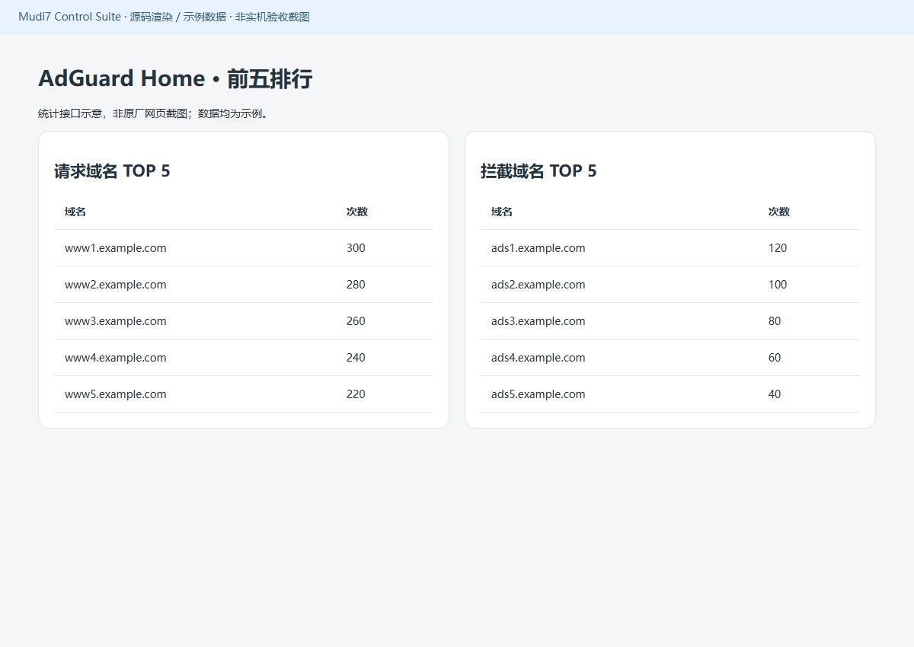

## 屏幕总览

总览覆盖主页面；其余状态和弹窗见上方单页。

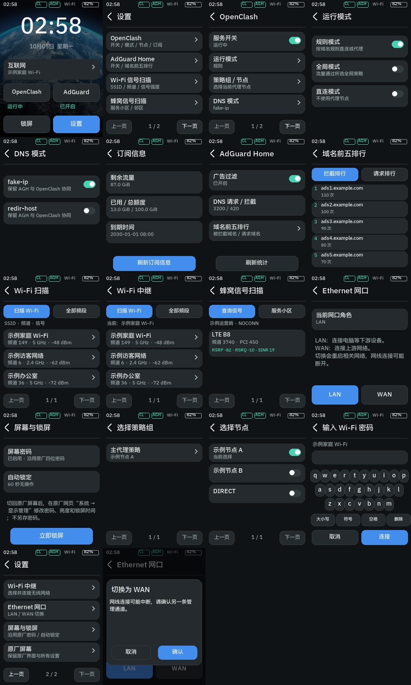

## 重新生成

```bash
python tools/render-screen.py --font /path/to/local-cjk-font.ttf --wallpaper /path/to/local-wallpaper.png
npm install
node tools/render-web.cjs
```

渲染不会读取路由器数据，不会连接网络、不写 framebuffer。不要用真实数据替换示例然后公开提交。
